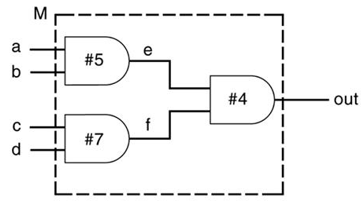
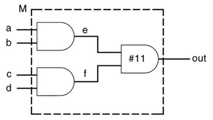

### Microprocessor Interface 시험범위

#### 1. 강의 6 Design Vending Machine (자판기) [p15]

- ##### state diagram 그리기 

 

####  2. 강의 6 Mealy FSM(Finity State Machine) [p16~17]

- ##### always 2개 구문 외우기 

``` verilog
	// 순차적으로 state를 정기적으로 업데이트 해준다
// posedge : 0에서 1이 되는 순간
// negedge : 1에서 0이 되는 순간
always@(posedge clk or negedge reset)
    if(!reset)
        next <= IDLE;
	else
        next <= next;

//state업데이트에 대한 비동기 초기화
```

``` verilog
//state Diagram 대로 코드짜기
always@(state or D or N or Q)
    begin
        DC = 0; DN = 0; DD = 0;
        case(state)
            IDLE:
                if(Q)
                    next = GOT_25c;
            else if(N)
                	next = GOT_5c;
            else if(D)
                next = GOT_10c;
            else
                next = IDLE;
            GOT_5c:
                if (Q)
                    DC = 1; next = IDLE;
            else if(D)
                	next = GOT_15c;
            else if(N)
                next = GOT_10c;
            else 
                next = GOT_5c;
            GOT_10c:
                if(Q)//35
                    DC = 1; next = RETURN_5c;
            else if(N)//15
                next = GOT_15c;
            else if(D)//20
                next = GOT_20c;
            else 
                next = GOT_10c;
            GOT_15c:
                if(Q)//40
                    DC = 1; next = RETURN_10c;
            else if(D)//25
                next = GOT_25c;
            else if(N)//20
                next = GOT_20c;
            else:
                next = GOT_15c;
            GOT_20c:
                if(Q)//45
                    DC = 1; next = RETURN_15c;
            else if(D)//30
                DC = 1; next = IDLE;
            else if(N)//25
                next = GOT_25c;
            else 
                next = GOT_20c;
            GOT_25c: 
                if(Q)//50
                    DC = 1; next = RETURN_20c;
            else if(D)//35
                DC = 1; next = RETURN_5c;
            else if(N)//30
                DC = 1; next = IDLE;
            else 
                next = GOT_25c;
            
            RETURN_5c:
                begin
                	DN = 1; next = IDLE;
                end
            RETURN_10C:
                begin
                	DD = 1; next = IDLE;
                end
            RETURN_15C:
                begin
                	DD = 1; next=RETURN_5c;
                end
            RETURN_20C:
                begin
                	DD = 1; next = RETURN_10c;
                end
            default:
                next = IDLE;
        endcase
    end
endmodule
                    

```


#### 3. 강의 7 Non blocking, Blocking [과제]

- ##### 과제 내용 숙지

- > Blocking : 해당 구문이 등장하는 시점에 할당이 이루어짐(=)
  >
  > Non Blocking : CLK 마지막 주기에 할당이 이루어짐 (<=)

``` verilog
module block_swap(x_out,y_out,clk,x,y);
  output x_out, y_out;
  input clk,x,y;
  reg x_val, y_val, tmp;
    
    always @(posedge clk)
        begin
            x_val = x;
            y_val = y;
                tmp = x_val;
                x_val = y_val;
                y_val = tmp;
        end
    assign x_out = x_val;
    assign y_out = y_val;
  
endmodule;
//Blocking떄는 순차적으로 바로 적용되어 교차가 이루어지지 않는다. 그래ㅓ 임시변수를 만들어 swap해야한다.
```

``` verilog
//Non Blocking떄는 정상적으로 교차가 이루어진다.
module nonblock_swap(x_out,y_out,clk,x,y);
  output x_out, y_out;
  input clk,x,y;
  reg x_val, y_val;
    
    always @(posedge clk)
        begin
            x_val = x;
            y_val = y;
                x_val <= y_val;
                y_val <= x_val;
        end
    assign x_out = x_val;
    assign y_out = y_val;
  
endmodule;
//Non Blocking떄는 일이 다 끝난후 할당되어 정상적으로 교차가 이루어진다.
```

``` verilog
module block_swap_tb;
	reg x,y, clk;
    wire x_out, y_out;
    
    block_swap blk_swp(x_out, y_out, clk, x, y);
    
    always #1 clk = !clk;
    
    initial begin
        x = 0; y = 0; clk = 0;
        #4 x = 0; y = 0;
        #4 x = 0; y = 1;
        #4 x = 1; y = 0;
        #4 x = 1; y = 1;
    end

endmodule
```


#### 4. 강의 7 Delay-based timing [과제]

- CASE1

``` verilog
initial //동시에
    begin
        b = 1'b1; c = 1'b0;
        #10 b = 1'b0;
initial//동시에
    begin
        d = #25 (b|c);
end

```

#0 b = 1 , c = 0, d = x;

#10 b = 0, c = 0, d = x;

#25 b = 0, c = 0,  d = 1 //intra assignment의 경우 우변의 식을 먼저 계산해버리기 때문에 0으로 바뀌기전에 1이 계산된다.


- CASE2

``` verilog
//Delay 실행 -> 우측 계산후 좌변에 할당
parameter latency = 20; 
parameter delta = 2;   
reg x, y, z, p, q;

initial
    begin 	  
        x = 0;                 
        #10 y = 1;
        #latency z = 0;
        #(latency + delta) p = 1;
        #y x = x + 1;
        #(1:5:6) q = 0;//평균의 정수값
```

#0 x = 0, y = x, z = x, p = x, q = x

#10 x = 0, y = 1, z = x, p = x, q = x
#30 x = 0, y = 1, z = 0, p = x, q = x

#52 x = 0, y = 1, z = 0, p = 1, q = x

#53 x = 1, y = 1, z = 0, p = 1, q = x

#53 x = 1, y = 1, z = 0, p = 1, q = x


- CASE3

``` verilog
initial //동시에
begin
    x = 1'b0;
    #5 y = 1'b1;
    fork
        #20 a = x;
        #15 b = y;
    join
    #40 x = 1'b1;
    fork
        #10 p = x;
        begin 
            #10 a = y;
            #30 b = x;
        end
        #5 m = y;
    join
end

```

#0  x = 0 , y = x , a = x , b = x , p  = x , m = x 

#5  x = 0 , y = 1 , a = x , b = x , p  = x , m = x 

#20  x = 0 , y = 1 , a = x , b = 1 , p  = x , m = x 

#25  x = 0 , y = 1 , a = 0 , b = 1 , p  = x , m = x 

#65  x = 1 , y = 1 , a = 0 , b = 1 , p  = x , m = x 

#70  x = 1 , y = 1 , a = 0 , b = 1 , p  = x , m = 1 

#75  x = 1 , y = 1 , a = 1 , b = 1 , p  = 1 , m = 1 

#105  x = 1 , y = 1 , a = 1 , b = 1 , p  = 1 , m = 1 


#### 5. 강의 7 Generate Blocks, Parallel block[과제]

``` verilog
module BeginEnd(clk,y_out,Z_out,W_out);
	input clk;
    output y_out, z_out, w_out;
    reg y_val, z_val, w_val;
    
    always@(posedge clk)
        begin 
            #10 y_val = 1'b1;
            #20 z_val = 1'b1;
            #30 w_val = 1'b1;
        end
    assign y_out = y_val;
    assign z_out = z_val;
    assign w_out = w_val;
endmodule;
# Sequential Delay이므로 10 -> 30(+20) -> 70(+40) 시점에서 1로 증가한다.
```

``` verilog
module forkJoin(clk,y_out,Z_out,W_out);
 	input clk;
    output y_out, z_out, w_out;
    reg y_val, z_val, w_val;
    
    always@(posedge clk)
        fork
            #10 y_val = 1'b1;
            #20 z_val = 1'b1;
            #30 w_val = 1'b1;
        join
    assign y_out = y_val;
    assign z_out = z_val;
    assign w_out = w_val;
endmodule;
# Parellar Delay이므로 10 -> 20 -> 40 시점에서 1로 증가한다.
```

``` verilog
module forkJoin_tb;
 reg a,b,clk;
  wire y_out,Z_out,W_out;
  always #1 clk = !clk;
  initial begin
    a=0;b=0;clk=0;
  end
  forkJoin _forkJoin(clk,y_out,Z_out,W_out);
endmodule
```


#### 6. 강의 8 Function Task [p10]

- ##### Example 8-7: Parity Calculation

``` verilog
//패리티 비트 계산
module parity;
    ...
    reg[31:0] addr;
    reg parity;
    always@(addr)
        begin 
            parity = calc_parity(addr);
            $display("Parity calc = %b", calc_parity(addr));
        end
    function calc_parity;
        input [31:0] address;
        begin 
            calc_parity = ^address;
        end
    endfunction
    ...
endmodule 
```

- ##### Example 8-7: Parity Calculation

``` verilog
//패리티 비트 계산
module parity;
    ...
    reg[7:0] result;
    reg[3:0] a, b;
    reg parity;
    always@(addr)
        begin 
            result = multiply(a,b);
            $display("Parity calc = %b", calc_parity(addr));
        end
    function multiply;
        input [3:0] a;
        input [3:0] b;
        begin 
            multiply = a*b;
        end
    endfunction
    ...
endmodule 
```


#### 7. 강의 8 Automatic Function [p13]

- ##### Example 8-10: Recursive (Automatic) Functions

``` verilog
module top;
    ...
    function automatic integer factorial;
        input [31:0] oper;
        integer i;
        begin 
            if(oper > 2)
                factorial = factorial(oper - 1)* oper;
            else
                factorial = 1;
        end
    endfunction
    integer result;
    initial
        begin 
            result = factorial(4);
            $display("%0d", result);
        end
    ...
endmodule 
```


- ##### Example 8-10: Recursive (Automatic) Functions

``` verilog
module factorial(result, i);
    input i;
    output result;
    reg i_val, result_val;
    
    task cal_fac;
        input i;
        output result;
        begin
            cal_fac(i-1, result) * i;
        end
    endtask
    
    initial
        begin
            i_val = i;
            cal_fac(i_val, result_val)
        end
endmodule 
```

- ##### Example 8-10: Recursive (Automatic) Functions

``` verilog
module factorial(result, i);
    input[3:0] i;
    output[31:0] result;
    reg[3:0] i_val
    reg[31:0] result_val;
    
    task cal_fac;
        input[3:0] i;
        output[31:0] result;
        begin
            cal_fac(i-1, result) * i;
        end
    endtask
    
    initial
        begin
            i_val = i;
            cal_fac(i_val, result_val)
        end
endmodule 
```


#### 8. 강의 8-9 assign구문 왜 있을까? [p23 밑에서 5번째줄]

- ##### 왜 저 구문이 필요할까?

``` verilog
// UART_TxD
//indicated the rising edge of bit clock 
// 정기적으로 bclk_delayed주기로 bclk_rising 바꾸어줘 always문에 신호를 전송한다.
// bitclock의 rising edge를 indicated해준다.
// ~bclk_delayed: 비트 뒤집기
assign	bclk_rising = bclk & (~bclk_delayed);
```


#### 9. 강의 8-9 UART Transmitter [p23,25]

- ##### always구문 2개 숙지

한개는 State를 업데이트하고 모니터링하기위해 존재하고

한개는 

#### 10. 강의 8-9 UART Receiver assign구문 외우기 [p31 마지막줄]

- ##### 왜 저 구문이 필요할까?

``` verilog
// UART_RxD
//indicated the rising edge of bit clock 
// 
// ~BclkX8_Dlayed: 비트 뒤집기
assign BclkX8_Rising = BclkX8 & (~BclkX8_Dlayed);
```


#### 11. 강의 8-9 UART Receiver [p32,35]

- ##### always구문 2개 숙지 type구분

**always @ (state or RxD or RDRF or ct1 or ct2 or BclkX8_Rising)**

은 bit의 수신상태에 따라 state를 바꿔주눈 역할을 한다.

**always @ (posedge sysclk or negedge rst_b)**

은 receive된 bit가 있는지 detect하고 수신한다.

#### 12. 강의 10  Distribute Delay



``` verilog
//Distribute Delay by gate module
module M (out, a, b, c, d);
    output out
    input a,b,c,d;
    wire e,f;
    and #5 a1(e,a,b);
    and #7 a2(f,c,d);
    and #4 a3(out,e,f);
endmodule 
```

``` verilog
//Distribute Delay by data flow
module M (out, a, b, c, d);
    output out
    input a,b,c,d;
    wire e,f;
    assign #5 e = a & b;
    assign #7 f = c & d;
    assign #4 out = e & f;
endmodule 
```


#### 13.강의 10  Lumped Delay



``` verilog
module M (out, a, b, c, d);
	output out
    input a,b,c,d;
    wire e,f;
    and a1(e,a,b);
    and a2(f,c,d);
    and #11 a3(out,e,f);
	
endmodule 
```

