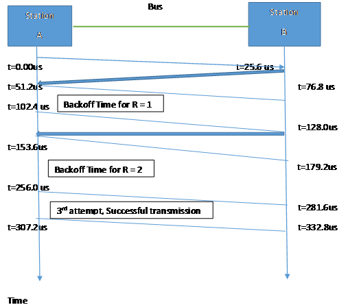
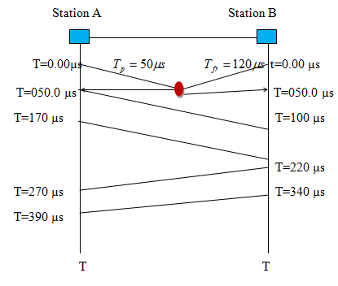

# Multiple Access Control

Random access protocol : 눈치껏 말하자!

- ALOHA : 무지성 전송 될대로 되라
- Slotted ALOHA : 주기적으로 나눠서 무지성 전송
- CSMA : 전선이 비면 바로 전송 시작 
- CSMA/CD : 전선이 비면 바로 전송 시작 다른 애들이랑 섞이면 중단
- - 1-persistant
  - Non persistant
  - p-persistant
- CSMA/CA: contention window,IFS 눈치 엄청봄

Controlled access protocol : 발언권을 정식으로 얻어서 말하자!

- Reservation : user 별로 slot을 마련하고 거기에 Data를 실음
- Polling : primary 기기를 무조건 거치때 사용하는 controlled access 방법
- Token Passing :Logical Ring을 구성했을때 사용하는방법

Channelization Protocol : 방을 나누어 따로 말하자!

- FDMA: Guardband로 주파수를 나누어 전송
- TDMA : 시간으로 나눠서 전송
- CDMA : C

Multiple Access Control 자문자답 4개문

> 1. 어떤 상황에서 채널에 접근 할까?
> 2. 채널이 사용중이면 어떻게 처리해야할까?
> 3. 전송이 성공했는지 실패했는지 어떻게 알수 있을까?
> 4. 충돌이 감지되었다면 어떻게 처리해야할까?

### 예제

#### Example 12.2) A pure ALOHA network transmits 200-bit frames on a shared channel of 200 kbps. What is the requirement to make this frame collision-free?
Vulnerable time이 2ms이기 때문에 전송시작 1ms 전과 전송 시작후 1ms 동안은 아무도 전송을 해서는 안된다.  

#### Example 12.3) A pure ALOHA network transmits 200-bit frames on a shared channel of 200 kbps. What is the throughput if the system (all stations together) produces
a. 1000 frames per second?

단위시간 Tfr당 1ms 이다. 1초에 1000개의 frame을 전송하므로 1ms당 1개 frame, G=1이다.

S = G * e^-2G (e ~= 2.17)

S = 1 * (2.17)^-2 = 0.135

#### b. 500 frames per second?

Tfr = 1ms이다. 1초에 500개의 frame을 전송함으로 1ms당 1/2개, G = 1/2이다.  

S = 0.5 * (2.17)^-1 = 0.184

#### c. 250 frames per second?

Tfr = 1ms이다. 1초에 250개의 frame을 전송함으로 1ms당 1/4개, G = 1/4이다.  

S = 0.5 * (2.17)^(-0.5) = 0.152

#### Example 12.4) A slotted ALOHA network transmits 200-bit frames using a shared channel with a 200-kbps bandwidth. Find the throughput if the system (all stations together) produces
a. 1000 frames per second.

단위시간 Tfr당 1ms 이다. 1초에 1000개의 frame을 전송하므로 1ms당 1개 frame, G=1이다.

S = G * e^-G (e ~= 2.17)

S = 1 * (2.17)^-2 = 0.368

#### b. 500 frames per second.

단위시간 Tfr당 1ms 이다. 1초에 1000개의 frame을 전송하므로 1ms당 1/2개 frame, G=1/2이다.

S = G * e^-G (e ~= 2.17)

S = 0.5 * (2.17)^-1/2 = 0.303

#### c. 250 frames per second.

단위시간 Tfr당 1ms 이다. 1초에 1000개의 frame을 전송하므로 1ms당 1/4개 frame, G=1/4이다.

S = G * e^-G (e ~= 2.17)

S = 0.25 * (2.17)^-1/4 = 0.195

#### Example 12.5) A network using CSMA/CD has a bandwidth of 10 Mbps. If the maximum propagation time (including the delays in the devices and ignoring the time needed to send a jamming signal, as we see later) is 25.6 μs, what is the minimum size of the frame?
Tp = 10,000,000 *  256/10,000,000 = 256bit

Tfr = 2 * Tp = 512bits

### 퀴즈

#### Q12-1. Which of the following is a random-access protocol?

#### a. CSMA/CD  /  b. Polling  /  c. TDMA

a

#### Q12-2. Which of the following is a controlled-access protocol?

#### a. Token-passing  /  b. Polling  /  c. FDMA

b

#### Q12-3. Which of the following is a channelization protocol?

#### a. ALOHA  /  b. Token-passing  /  c. CDMA

c

#### Q12-4. Stations in a pure Aloha network send frames of size 1000 bits at the rate of 1 Mbps. What is the vulnerable time for this network?
Tfr은 1000bit짜리 frame을 1Mbps로 보냄으로 1초에 1000개 frame, 1Tfr은 1ms이다

따라서 pure Aloha network에서는 vulnerable Time은 2ms이다.

#### Q12-5. Stations in an slotted Aloha network send frames of size 1000 bits at the rate of 1 Mbps. What is the vulnerable time for this network?

Tfr은 1000bit짜리 frame을 1Mbps로 보냄으로 1초에 1000개 frame, 1Tfr은 1ms이다

따라서 slotted Aloha network에서는 vulnerable Time은 1ms이다.

#### Q12-6. In a pure Aloha network with G = 1/2, how is the throughput affected in each of the following cases?

S = 0.5 * (2.17)^-1 = 0.184

#### a. G is increased to 1. 

S = 1 * (2.17)^-2 = 0.135

전송을 시도한 frame중 13.5%만 성공적으로 도착한다. 성공률이 감소했다.

#### b. G is decreased to 1/4.

S = 0.5 * (2.17)^(-0.5) = 0.152

전송을 시도한 frame중 15.2%만 성공적으로 도착한다. 성공률이 감소했다.

#### Q12-7. In a slotted Aloha network with G = 1/2, how is the throughput affected in each of the following cases?

S = 0.5 * (2.17)^-1/2 = 0.303

#### a. G is increased to 1. 

S = 1 * (2.17)^-2 = 0.368

전송을 시도한 frame중 36.8%만 성공적으로 도착한다. 성공률이 증가했다.

#### b. G is decreased to 1/4.

S = 0.25 * (2.17)^-1/4 = 0.195

전송을 시도한 frame중 19.5%만 성공적으로 도착한다. 성공률이 감소했다.

#### Q12-8. To understand the uses of K in Figure 12.3(Pure ALOHA), find the probability that a station can send immediately in each of the following cases:
#### a. After one failure. 

K=1이므로 Backoff Time을 산정하는 R = 0~1중 R=0이 선택될 확률은 50 %이다. 

#### b. After three failures.

K=1이므로 Backoff Time을 산정하는 R = 0~7중 R=0이 선택될 확률은 12.5 %이다. 

#### Q12-9. To understand the uses of K in Figure 12.13(CSMA/CD), find the probability that a station can send immediately in each of the following cases:

#### a. After one failure. 

K=1이므로 Backoff Time을 산정하는 R = 0~1중 R=0이 선택될 확률은 50 %이다. 

#### b. After four failures.

K=1이므로 Backoff Time을 산정하는 R = 0~15중 R=0이 선택될 확률은 6.25 %이다. 

#### Q12-10. To understand the uses of K in Figure Figure 12.15(CSMA/CA), find the probability that a station can send immediately in each of the following cases:

#### a. After two failures. 

K=1이므로 Backoff Time을 산정하는 R = 0~3중 R=0이 선택될 확률은 25 %이다. 

#### b. After five failures.

K=1이므로 Backoff Time을 산정하는 R = 0~31중 R=0이 선택될 확률은 약 3 %이다. 

#### Q12-11. Based on Figure 12.3, how do we interpret success in an Aloha network?

receive ACK

#### Q12-12. Based on Figure 12.13, how do we interpret success in an Aloha network?

transmit complete without collision occur

#### Q12-13. Based on Figure 12.15, how do we interpret success in an Aloha network?

receive ACK

#### Q12-14. Assume the propagation delay in a broadcast network is 5 μs and the frame transmission time is 10 μs.
#### a. How long does it take for the first bit to reach the destination?

5us

#### b. How long does it take for the last bit to reach the destination after the first bit has arrived?

10us

#### c. How long is the network involved with this frame (vulnerable to collision)?

15us

#### Q12-15. Assume the propagation delay in a broadcast network is 3 μs and the frame transmission time is 5 μs. Can the collision be detected no matter where it occurs?
Yes, it can

#### Q12-16. Assume the propagation delay in a broadcast network is 6 μs and the frame transmission time is 4 μs. Can the collision be detected no matter where it
occurs?
No, It can't. If transmission time is shorter than propagation time. Then, when the transmission packet has arrived, the collision packet transmission was already done. So It can't be detected.

#### Q12-17. Explain why collision is an issue in random access protocols but not in controlled access protocols.
Controlled access protocol에서는 통제된 상황에서 전송을 허가 받거나 별도로 분리되어 전송되기 때문에 collision이 일어나지 않는다.

#### Q12-18. Explain why collision is an issue in random access protocols but not in channelization protocols.

전파의 물리적인 특성이나 별도의 처리를 기준으로 일종의 별도의 공간에서 전송되기 때문에 collision이 일어나지 않는다.

#### Q12-19. Assume the propagation delay in a broadcast network is 5 μs and the frame transmission time is 10 μs.
a. How long does it take for the first bit to reach the destination?

5

#### b. How long does it take for the last bit to reach the destination after the first bit has arrived?

10

#### c. How long is the network involved with this frame (vulnerable to collision)?

15

#### Q12-20. Assume the propagation delay in a broadcast network is 12 μs and the frame transmission time is 8 μs.
#### a. How long does it take for the first bit to reach the destination?

12

#### b. How long does it take for the last bit to reach the destination after the first bit has arrived?

8

#### c. How long is the network involved with this frame (vulnerable to collision)?

20

#### P12-10. A slotted Aloha network is working with maximum throughput.

#### a. What is the probability that a slot is empty?

slotted ALOHA에서 maximum throughput은 G=1일때 S = G * e^(-G) 

S = 1*e(-1) = 0.3679

#### b. How many slots, n, on average, should pass before getting an empty slot?

Expectation of Empty slot = 1/0.3679 = 2.7181

#### P12-11. One of the useful parameters in a LAN is the number of bits that can fit in one meter of the medium (nb/m). Find the value of nb/m if the data rate is 100 Mbps and the medium propagation speed is 2 × 10^8 m/s.
T(nb/m) = 100 * 10^6 / 2 * 10^8 = 1/ 2 = 0.5 b/m

#### P12-12. Another useful parameter in a LAN is the bit length of the medium (Lb), which defines the number of bits that the medium can hold at any time. Find the bit length of a LAN if the data rate is 100 Mbps and the medium length in meters (Lm) for a communication between two stations is 200 m. Assume the propagation speed in the medium is 2 × 10^8 m/s.
 100bits

#### P12-14. In a bus CSMA/CD network with a data rate of 10 Mbps, a collision occurs 20 μs after the first bit of the frame leaves the sending station. What should the length of the frame be so that the sender can detect the collision?

Tfr > 2Tp  (Transmission Delay는 갔다가 돌아오는거 까지 해서 종단 시간의 2배이어야한다.)

Tfr = 40us

(10* 10^6) * 40 * (10^-6) = 400 bits

#### P12-15. Assume that there are only two stations, A and B, in a bus CSMA/CD network. The distance between the two stations is 2000 m and the propagation speed is 2 × 10^8 m/s. If station A starts transmitting at time t1:

#### a. Does the protocol allow station B to start transmitting at time t1 + 8 μs? If
the answer is yes, what will happen?

(A에서 B까지 도착하는 시간)= propagation Time = 2000 / 2* 10^8 = 1/10^5 = 10us

B에서 전송을 허락한다. 그럴 경우 2us후에는 Colision detection이 충돌을 감지하고 전송을 실패한채 jamming signal을 보내고 Backoff time을 대기하게된다. 

#### b. Does the protocol allow station B to start transmitting at time t1 + 11 μs? If
the answer is yes, what will happen?

B는 전송을 허락하지 않는다. A에서 출발한 신호가 B을 지나가고 있어서 collision Detection 상태를 유지한채 회선이 비길 기다린다.

#### P12-16. There are only two stations, A and B, in a bus 1-persistence CSMA/CD network with Tp = 25.6 μs and Tfr = 51.2 μs. Station A has a frame to send to station B. The frame is unsuccessful two times and succeeds on the third try. Draw a time line diagram for this problem. Assume that the R is 1 and 2 respectively and ignore the time for sending a jamming signal (see Figure 12.13).

#### P12-17. To understand why we need to have a minimum frame size Tfr = 2 × Tp in aCDMA/CD network, assume we have a bus network with only two stations, A and B, in which Tfr = 40 μs and Tp = 25 μs. Station A starts sending a frame at time t = 0.0 μs and station B starts sending a frame at t = 23.0 μs. Answer the following questions:

#### a. Do frames collide?

Yes 24us 시점에서 충돌이 발생한다.

#### b. If the answer to part a is yes, does station A detect collision?

A는 이미 frame을 다 보내 버려서 B의 신호가 A에 도착해 충돌 감지가 물리적으로 가능해진 시점에서는 Collision으로 인식하지 못한다.

#### c. If the answer to part a is yes, does station B detect collision?

B는 충돌을 감지한다. 2us보내고 이후에는 Collision detection을 잡게 된다.

#### P12-18. In a bus 1-persistence CSMA/CD with Tp = 50 μs and Tfr = 120 μs, there are two stations, A and B. Both stations start sending frames to each other at the same time. Since the frames collide, each station tries to retransmit. Station A comes out with R = 0 and station B with R = 1. Ignore any other delay including the delay for sending jamming signals. 

#### Do the frames collide again? 

If Random number is not 0, The transmission can be success in second transmission

#### Draw a time-line diagram to prove your claim. 

#### Does the generation of a random number help avoid collision in this case?

도움이 되었다, R의 차이로 한쪽의 Back off Time동안 다른 한쪽에서 전송을 마무리할 시간을 벌었다.

#### P12-24. Check to see if the following set of chips can belong to an orthogonal system.

> [+1, +1, +1, +1] , [+1, −1, −1, +1] , [−1, +1, +1, −1] , [+1, −1, −1, +1]

> CDMA에서 orthogonal system임을 확인하는 3가지 조건
>
> 1. 2의 제곱수인 쌍을 가지고 있어야한다.
> 2. 내적의 조합에서 2개는 내적의 결과가 0이어야한다.
> 3. 자기 자신과 내적했을때 내적값은 반드시 N과 같아야한다.

1. 4개임으로 2의 제곱수 조건을 만족한다.

2. A.B = [+1, +1, +1, +1] . [+1, −1, −1, +1]

   =[+1,-1,-1,+1]

   =0

   B.C = [+1, −1, −1, +1] . [−1, +1, +1, −1]

   =[-1,-1,-1,-1]

   =-4

   C.D = [−1, +1, +1, −1] . [+1, −1, −1, +1]

   =[-1,-1,-1,-1]

   =-4

   3가지중 1개만 0이므로 조건에 만족하지 않는다.

3. A.A = [+1, +1, +1, +1].[+1, +1, +1, +1]

   = [+1,+1,+1,+1] 

   = +4

   B.B = [+1, −1, −1, +1].[+1, −1, −1, +1]

   = [+1,+1,+1,+1] 

   = +4

   C.C = [−1, +1, +1, −1].[−1, +1, +1, −1]

   = [+1,+1,+1,+1] 

   = +4

   D.D = [+1, −1, −1, +1].[+1, −1, −1, +1]

   = [+1,+1,+1,+1] 

   = +4

   모두 총 개수 4개와 같음으로 조건에 부합한다

4. 결론적으로 조건 2가 부합하지 않음으로 CSMA에서 사용하기에 부적절한 시스템이다.