## 현대 우주와 추진체계 시스템 기말고사 범위

#### NOTE4

1. 

> 태양은 태양풍의 근원이며 태양 표면에서 코로나 질량 방출이 일어납니다.  

2. Electromagnetic spectrum

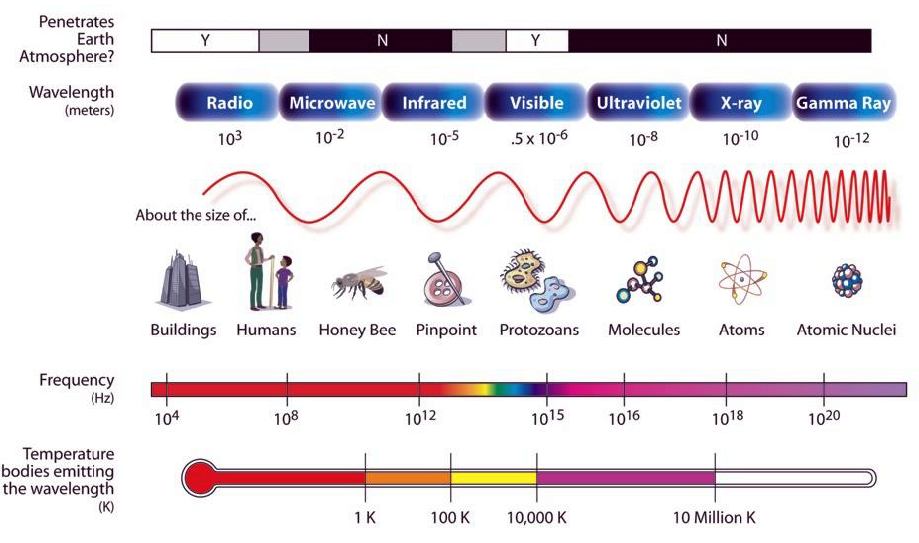

파장보다 작은 물체를 투과합니다.

3. > The mean solar daily flux at the wavelength λ=10.7 cm is used as an indicator for the solar EUV radiation reaching the top of the earth’s atmosphere.

   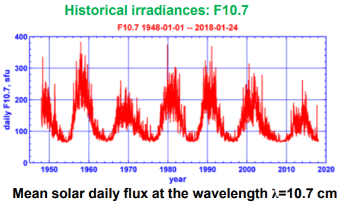

#### NOTE6

1. 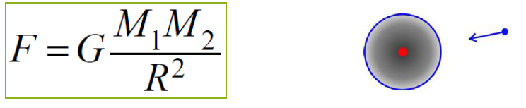

> universal gravitational constant and R is the distance between these two bodies

> G는 만유인력 계수이며 두 물체사이의 거리에 반비례한다.

2.  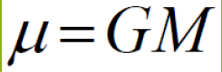

> One can introduce a gravitational parameter , μ , which is a product of the central body mass and the universal gravitational constant

> 중력 계수  μ는 물체의 질량과 중력계수의 곱이다.

3.

> Kepler's laws of planetary
>
> 1. The orbit of a planet is an ellipse with the Sun at one of the two foci
>    - The planets orbit the Sun in ellipses with the Sun at one focus (the other focus is empty)
> 2. A line segment joining a planet and the Sun sweeps out equal areas during equal intervals of time
> 3. The square of a planet's orbital period is proportional to the cube of the length of the semi major axis of its orbit . 

4. Earth Oblateness

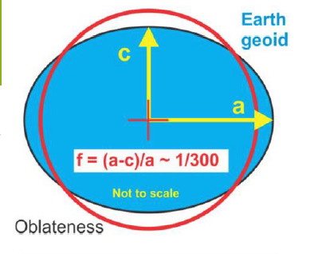

> Geoid = equipotential surface of the gravity field most closely approximating mean sea level
>
> Accurate geoid model produced by the Gravity field and steady-state Ocean Circulation Explorer (GOCE) mission.

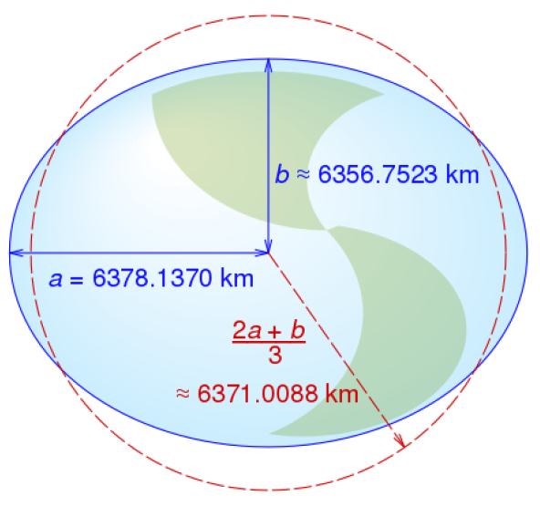

>• equatorial radius: R e = 6378.14 km
>• polar radius: R p = 6356.8 km
>• volumetric radius: R v = 6371.0 km
>
>volumetric mean radius is the radius of a sphere
>with the same volume
>
>- orbit altitude commonly referred to the difference between the orbit radius and the equatorial radius
>- h (orbit altitude) = R (orbit radius) - Re (equatorial radius or a=6378 km)

#### NOTE7

1. > The azimuth is the angle formed between a reference direction (in this example north) and a
   > line from the observer (origin) to a point of interest projected on the same plane as the reference direction orthogonal to the zenith

   >The zenith is an imaginary point directly "above" a particular location, on the imaginary celestial
   >sphere. "Above" means in the vertical direction opposite to the gravity direction at that location.
   >The zenith is the "highest" point on the celestial sphere.

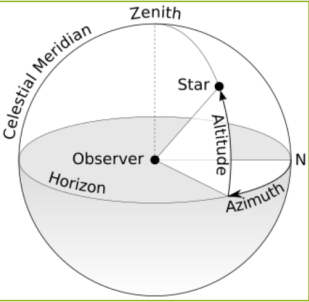

2. > Cape Canaveral is a prominent cape in Brevard County, Florida, in the United States, near the
   > center of the state's Atlantic coast.
   >
   > The first rocket launched at the Cape was a V 2 rocket named Bumper 8 from Launch Complex 3 on 24 July 1950.

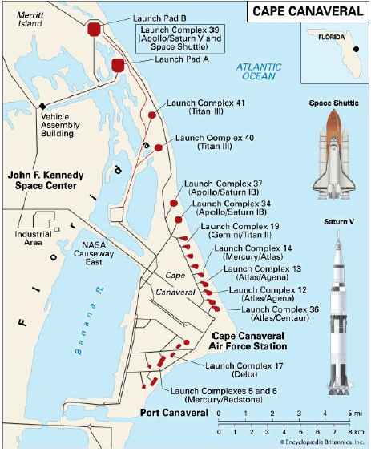

3. Geostationary orbit (GEO)

   > Satellites in geostationary orbit (GEO) circle Earth above the equator from west to east following Earth’s rotation taking 23 hours 56 minutes and 4 seconds by travelling at exactly the same rate as Earth. This makes satellites in GEO appear to be ‘stationary’ over a fixed position. In order to perfectly match Earth’s rotation, the speed of GEO satellites should be about 3 km per second at an altitude of 35 786 km. This is much farther from Earth’s surface compared to many satellites.

   > GEO is used by satellites that need to stay constantly above one particular place over Earth, such as telecommunication satellites. This way, an antenna on Earth can be fixed to always stay pointed towards that satellite without moving. It can also be used by weather monitoring satellites, because they can continually observe specific areas to see how weather trends emerge there.

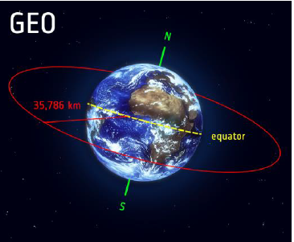

4. Low Earth orbit (LEO)

> A low Earth orbit (LEO) is, as the name suggests, an orbit that is relatively close to Earth’s surface. It is normally at an altitude of less than 1000 km but could be as low as 160 km above Earth which is low compared to other orbits, but still very far above Earth’s surface.

> By comparison, most commercial aeroplanes do not fly at altitudes much greater than approximately 14 km, so even the lowest LEO is more than ten times higher than that.

> Unlike satellites in GEO that must always orbit along Earth’s equator, LEO satellites do not always have to follow a particular path around Earth in the same way their plane can be tilted. This means there are more available routes for satellites in LEO, which is one of the reasons why LEO is a very commonly used orbit

> LEO’s close proximity to Earth makes it useful for several reasons. It is the orbit most commonly used for satellite imaging, as being near the surface allows it to take images of higher resolution. It is also the orbit used for the International Space Station (ISS), as it is easier for astronauts to travel to and from it at a shorter distance. Satellites in this orbit travel at a speed of around 7.8 km per second; at this speed, a satellite takes approximately 90 minutes to circle Earth, meaning the ISS travels around Earth about 16 times a day.

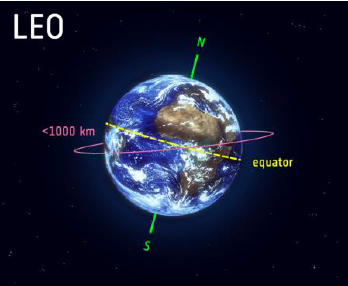

#### NOTE8

1. NASA Deep Space Network (DSN)

   >  NASA’s international array of giant radio antennas that supports interplanetary spacecraft missions, plus a few that orbit Earth Worldwide network of U.S. spacecraft communication facilities, located in the United States (California), Spain (Madrid), and Australia (Canberra), that supports NASA's interplanetary spacecraft missions

> The DSN also provides radar and radio astronomy observations that improve our understanding of the solar system and the larger universe
>
> It performs radio and radar astronomy observations for the exploration of the
> Solar System and the universe, and supports selected Earth orbiting missions.

> DSN is part of the NASA Jet Propulsion Laboratory (JPL).

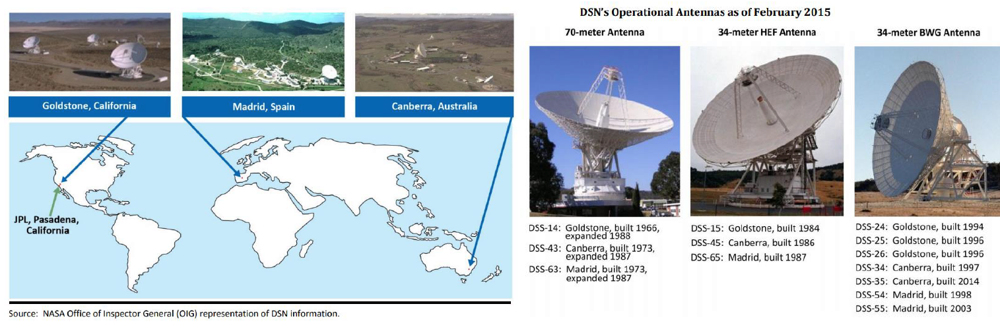

2. Lunar Laser Ranging (LLR)

>Lunar Laser Ranging (LLR) is the practice of measuring the distance between the surfaces of the Earth and the Moon using laser ranging.

> The distance can be calculated from the round trip time of laser light pulses travelling at the speed of light, which are reflected back to Earth by the Moon's surface or by one of five retroreflectors installed on the Moon during the Apollo program (11, 14, and 15) and Lunokhod 1 and 2 missions (a series of Soviet robotic lunar rovers designed to land on the Moon between 1969 and 1977).
> -> Successfully placed reflectors

> A precise measurement is made using retroreflectors at known locations.

> Laser ranging measurements can also be made with
> retroreflectors installed on Moon orbiting satellites

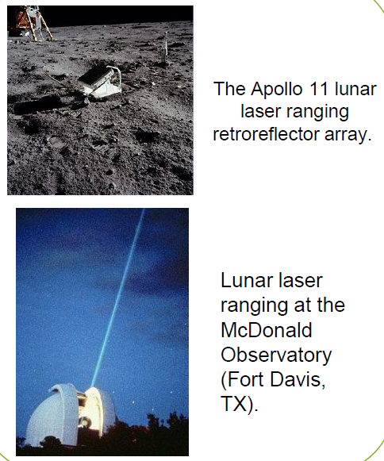

3. GPS = Global Positioning System 

#### NOTE9

- Skylab : Skylab was the first United States space station, launched by NASA , occupied for about 24 weeks between May 1973 and February 1974.Major operations included an orbital workshop, a solar
  observatory, Earth observation, and hundreds of experiments.
- Salyut : The Salyut program was the first space station program, undertaken by the Soviet Union in 1971.Salyut 7 re entered Earth’s atmosphere and burned up on February 7, 1991, ending the Salyut program.
- Mir : Mir was a space station that operated in low Earth orbit from 1986 to 2001, operated by the Soviet Union and later by Russia. It had a greater mass than any previous spacecraft. At the time it was the largest artificial satellite in orbit, succeeded by the International Space Station (ISS) after Mir's orbit decayed. The station served as a microgravity research laboratory in which crews conducted experiments in biology, human biology, physics, astronomy, meteorology, and spacecraft systems with a goal of developing technologies required for permanent occupation of space.
- Tiangong : Tiangong is China's program to create a modular space station, comparable to Mir. This program is independent and unconnected to any other international space active countries.

- ISS : The ISS is suited for testing the spacecraft systems and equipment required for possible future long duration missions to the Moon and Mars. It is the largest artificial object in space and the largest satellite in low Earth orbit, regularly visible to the naked eye from Earth's surface. The ISS circles the Earth in roughly 93 minutes, completing 15.5 orbits per day 
- - The station is divided into two sections: the Russian Orbital Segment (ROS) is operated by Russia, while the United States Orbital Segment (USOS) is run by the United States as well as many other nations.
  - The station has since been continuously occupied for 20 years and 196 days, the longest continuous human presence in low Earth orbit, having surpassed the previous record of 9 years and 357 days held by the Mir space station.
  - The latest major pressurized module, Leonardo, was fitted in 2011 and an experimental inflatable space habitat was added in 2016. Development and assembly of the station continues, with several major new Russian elements scheduled for launch starting in 2021.

#### NOTE11 & 그외

1. Korea Space Launch Vehicle (Nuri) == KSLV

2. KARI(Korea Aerospace Research Institute)

3. >  [Christina Koch](https://www.nasa.gov/astronauts/biographies/christina-hammock-koch/biography) and [Dr. Jessica Ulrika Meir](https://www.nasa.gov/astronauts/biographies/jessica-u-meir/biography) (Ph.D in Marine Biology from UCSD in 2009, "[Blood oxygen transport and depletion : the key of consummate divers](https://escholarship.org/uc/item/7pk7c8sq)") had the[ first all-female spacewalk](https://youtu.be/cNnvYACgwrE) On October 18, 2019.

4. 영화 감상문 평가! 랜덤 2개

